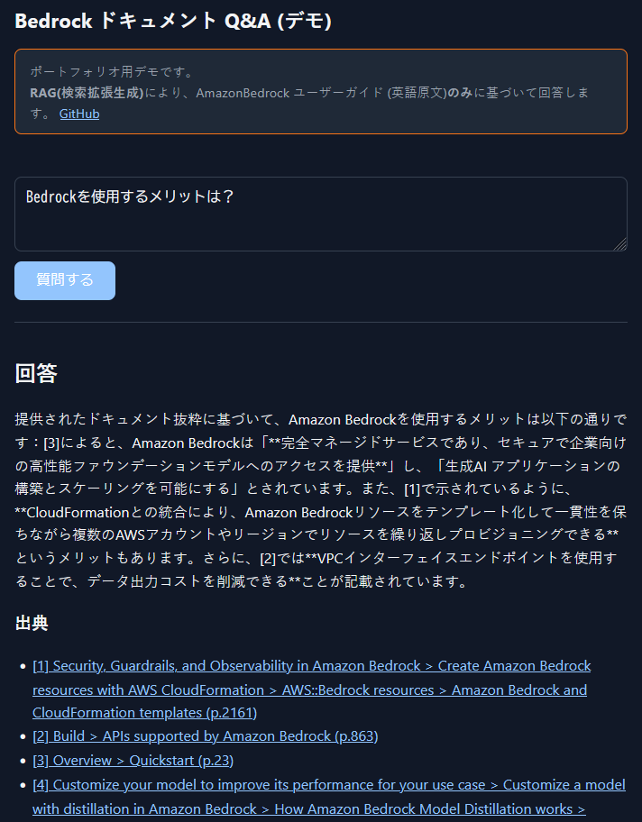
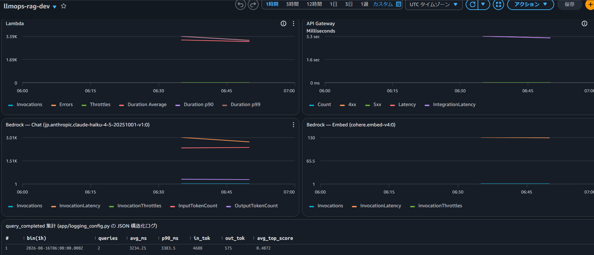

# LLMOps-RAG

[](https://github.com/yasaims/LLMOps-RAG/actions/workflows/ci.yml)
[](https://github.com/yasaims/LLMOps-RAG/actions/workflows/eval.yml)
[](https://github.com/yasaims/LLMOps-RAG/actions/workflows/terraform-apply.yml)

AWS 公式ドキュメントに対する日本語 Q&A RAG システム\
RAGAS による精度評価を PR のマージ必須チェックに組み込んだ LLMOps 基盤\
OIDC 認証で terraform による継続的デプロイを安全に実現

## このプロジェクトの主題

LLM アプリケーションは、プロンプトやチャンク分割などのわずかな変更で回答品質が静かに劣化する。
本プロジェクトは、その品質リグレッションを **PR の段階で自動評価してマージをブロックする仕組み**を、
評価パイプラインだけでなく AWS インフラ・CI/CD・監視・コスト管理まで含めて設計・構築したもの。

## プレビュー

**[Q&A デモはこちら](https://d1rr4ulyi0n3im.cloudfront.net/)**

> 乱用防止のため API Gateway のスロットリング (1 req/s) を掛けています。



## アーキテクチャ


Phase 別の詳細な構成図 (ローカル構成 / AWS 構成 / CI-CD / 監視・デモの内訳) は
[docs/architecture.md](docs/architecture.md) を参照。

## 技術スタック

| スキル   | 実装箇所                                                                                                                                      |
| -------- | --------------------------------------------------------------------------------------------------------------------------------------------- |
| AWS 構築 | Bedrock (Cohere Embed v4 + Claude Haiku 4.5) / Lambda / API Gateway / S3 Vectors / CloudFront / CloudWatch — [infra/modules/](infra/modules/) |
| IaC      | Terraform (モジュール分割、bootstrap → envs/dev の2段構成) — [infra/](infra/)                                                                 |
| CI/CD    | GitHub Actions 4 本 (lint/test, terraform plan/apply, RAG品質評価) + OIDC 認証 — [.github/workflows/](.github/workflows/)                     |
| LLMOps   | 検索・生成の自動評価をマージ必須チェック化、コスト実測、監視ダッシュボード — [evals/](evals/)                                                 |
| Python   | FastAPI 推論 API + 取り込みパイプライン、型ヒント + ruff — [app/](app/)                                                                       |

## 設計判断

| 項目           | 選定                                                                      | ADR                                                                                              |
| -------------- | ------------------------------------------------------------------------- | ------------------------------------------------------------------------------------------------ |
| 埋め込み       | `cohere.embed-v4:0` (日本語質問 × 英語原文のクロスリンガル検索)           | [0002](docs/adr/0002-embedding-model-selection.md)                                               |
| 生成           | `jp.anthropic.claude-haiku-4-5-20251001-v1:0` (推論プロファイル経由)      | [0004](docs/adr/0004-bedrock-inference-profile.md)                                               |
| ベクトルストア | pgvector (ローカル) / S3 Vectors (AWS、VPC不要でアイドル時ほぼ0円)        | [0001](docs/adr/0001-vector-store-selection.md) / [0005](docs/adr/0005-s3-vectors-for-phase2.md) |
| チャンク分割   | 見出し認識 + スライディングウィンドウ                                     | [0003](docs/adr/0003-chunking-strategy.md)                                                       |
| 実行基盤       | Lambda (コンテナイメージ) + API Gateway HTTP API                          | [0006](docs/adr/0006-lambda-container-http-api.md)                                               |
| 評価           | 検索は決定的指標 (recall@k/MRR)、生成は Ragas + Bedrock judge             | [0007](docs/adr/0007-eval-with-ragas-subset.md)                                                  |
| CI/CD          | GitHub OIDC (長期キーなし) + plan/apply/eval の3ロール + 品質ゲート       | [0008](docs/adr/0008-github-oidc-iam-roles.md) / [0009](docs/adr/0009-cicd-quality-gate.md)      |
| 監視           | 既存 JSON ログ + Logs Insights (EMF/詳細メトリクスは課金回避のため不使用) | [0010](docs/adr/0010-observability-dashboard.md)                                                 |
| デモ公開       | CloudFront 1 distribution + 2 origins で CORS を回避                      | [0011](docs/adr/0011-demo-frontend-cloudfront.md)                                                |

IAM 権限の全体像 (誰が何をできるか) は [docs/iam-permissions.md](docs/iam-permissions.md) にまとめている。

## 品質ゲート

PR ごとに `eval.yml` が本番 S3 Vectors に対して RAG 品質 (検索 + 生成) を評価し、
`evals/baseline.json` からのリグレッションがあればマージをブロックする
必須チェックとして機能する ([ADR 0007](docs/adr/0007-eval-with-ragas-subset.md) /
[ADR 0009](docs/adr/0009-cicd-quality-gate.md))。

| 指標                                                                      | baseline (25問) | tolerance | floor |
| ------------------------------------------------------------------------- | --------------: | --------: | ----: |
| `recall@5`                                                                |           0.680 |      0.02 |  0.50 |
| `mrr`                                                                     |           0.467 |      0.02 |  0.30 |
| `generation_score` (Faithfulness/FactualCorrectness/ContextRecall の平均) |           0.834 |      0.10 |  0.65 |
| `citation_format_valid`                                                   |           1.000 |      0.02 |  0.90 |

```bash
uv sync --group eval
VECTOR_STORE=s3vectors uv run python -m evals.run_eval \
  --dataset evals/datasets/bedrock-ug-qa.jsonl --baseline evals/baseline.json
```

## 運用・監視

CloudWatch ダッシュボード (`llmops-rag-dev`) で Lambda / API Gateway / Bedrock の
メトリクスとリクエストごとのレイテンシ・トークン数・検索スコアを可視化している([ADR 0010](docs/adr/0010-observability-dashboard.md))。



## ローカル起動手順

```bash
uv sync
cp .env.example .env

docker compose up -d                                   # pgvector 起動
uv run python -m app.ingestion.download_docs            # PDF 取得 (data/raw/, 非コミット)
uv run python -m app.ingestion.ingest --doc bedrock-ug --dry-run  # 規模確認
uv run python -m app.ingestion.ingest --doc bedrock-ug   # 埋め込み投入

uv run uvicorn app.api.main:app --reload
curl -s localhost:8000/query -H 'Content-Type: application/json' \
  -d '{"question":"Bedrock でモデルアクセスを有効にする手順は？"}'
```

## テスト

```bash
uv run ruff check .
uv run pytest -m "not integration"
```

## AWS へのデプロイ

`main` へのマージで `terraform-apply.yml` がイメージ build & push → `terraform apply` →
CloudFront invalidation → `/healthz` スモークテストまで自動実行する
([ADR 0009](docs/adr/0009-cicd-quality-gate.md))。以下は初回セットアップ・手動デプロイ用の手順:

```bash
# 1. tfstate 用 S3 + ECR + GitHub OIDC ロール (一度だけ)
terraform -chdir=infra/bootstrap init && terraform -chdir=infra/bootstrap apply

# 2. Lambda 用イメージを build & push
./scripts/push_image.ps1

# 3. cp infra/envs/dev/{backend.hcl,terraform.tfvars}.example → 値を埋めて apply
terraform -chdir=infra/envs/dev init -backend-config=backend.hcl
terraform -chdir=infra/envs/dev apply

# 4. データ投入 (pgvector に投入済みなら embed API 再課金なしで移送)
uv run python -m app.ingestion.migrate_to_s3vectors --doc bedrock-ug
uv run python -m app.ingestion.upload_docs --doc bedrock-ug  # 出典PDFの保管

terraform -chdir=infra/envs/dev output -raw demo_url    # デモ URL
curl "$(terraform -chdir=infra/envs/dev output -raw api_endpoint)healthz"
```

## コスト設計

- Bedrock は従量課金。ベクトルストアは S3 Vectors (VPC 不要、アイドル時ほぼ0円) —
  [ADR 0005](docs/adr/0005-s3-vectors-for-phase2.md)
- Lambda + API Gateway + CloudFront + S3 (web/docs) もアイドル時ほぼゼロ円。
  API Gateway のスロットリング (1 req/s) で乱用を抑制 — [ADR 0011](docs/adr/0011-demo-frontend-cloudfront.md)
- 評価 (eval) 1 回あたり実測 **$0.65 前後** (25問、`evals/measure_cost.py` で計測。
  内訳は回答生成 $0.09 + judge 3指標 $0.56) — [ADR 0007](docs/adr/0007-eval-with-ragas-subset.md)
- AWS Budgets + CloudWatch アラーム 5 本 → SNS メール通知
  ([ADR 0010](docs/adr/0010-observability-dashboard.md))

## 今後の課題

- **コスト超過時の自動停止** — 現状の AWS Budgets + CloudWatch アラームは通知のみ。予算超過時に
  API を自動停止する仕組み (スロットリング 0 化など) は未実装
- **検索のトピック取り違えによる誤答** — 検索結果には忠実 (faithfulness 高) なまま誤答する
  失敗モードがあり、top_k やチャンク分割の見直しを検討中
  ([#6](https://github.com/yasaims/LLMOps-RAG/issues/6))
- **`factual_correctness` が構造的に低く出る** — 参照解答が質問スコープより広く、
  正答でも減点される。データセット生成プロンプトの改善を検討中
  ([#7](https://github.com/yasaims/LLMOps-RAG/issues/7))

## 出典・ライセンス

回答は [Amazon Bedrock ユーザーガイド](https://docs.aws.amazon.com/bedrock/latest/userguide/)
(© Amazon Web Services, Inc. or its affiliates) を出典として検索・引用している。
ドキュメント原文はリポジトリにコミットせず、`download_docs.py` で都度取得する。
"AWS"、"Amazon Bedrock" は Amazon Web Services, Inc. の商標であり、本プロジェクトは
AWS と提携・承認された関係にない。
