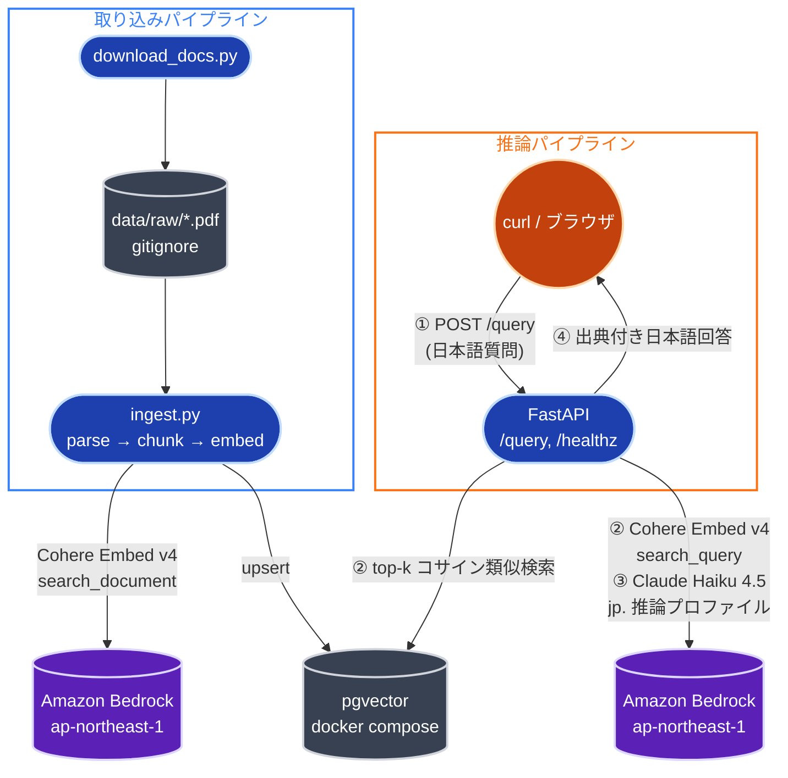
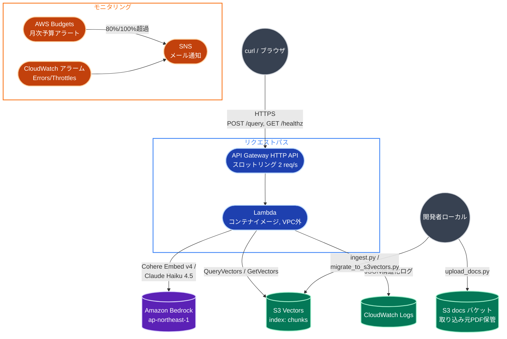
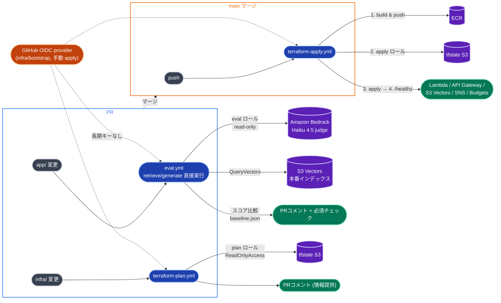

# アーキテクチャ

## Phase 1: ローカル構成

- **取り込み**: `download_docs.py` → `ingest.py` (parse → chunk → embed → upsert)
- **推論**: FastAPI `/query` が検索 (Retrieve) と生成 (Generate) を実行
- ベクトルストアは pgvector (docker compose)。Bedrock 呼び出しは `app/bedrock.py` に集約

## Phase 2: AWS 最小構成 (Terraform, デプロイ済み)

- Lambda (コンテナイメージ, x86_64) + API Gateway HTTP API でサーバーレス化 (アイドル時ゼロ円)
- **ベクトルストアは S3 Vectors** (Aurora Serverless v2 からの変更。[ADR 0005](adr/0005-s3-vectors-for-phase2.md))。
  VPC 不要のため NAT/VPC エンドポイントの常時課金が発生しない
- 取り込み (embed + PutVectors) はローカル/バッチから実行し、Lambda の実行時パスは
  検索専用 (最小権限の IAM)。[ADR 0006](adr/0006-lambda-container-http-api.md)
- AWS Budgets (月次) + CloudWatch アラーム (Errors/Throttles) → SNS メール通知。
  Budgets 超過時の自動停止 (計画書 §7.5) は Phase 4
- Terraform 構成: `infra/bootstrap` (tfstate用S3 + ECR, 一度きり) /
  `infra/modules/{vector-store,ingestion,api,observability}` / `infra/envs/dev`

## Phase 3: CI/CD 整備 (GitHub Actions)

- **`eval.yml`**: PR ごとに `app/rag/retrieve.py` / `app/rag/generate.py` を直接呼び出し、
  本番 S3 Vectors (read-only) に対して RAG 品質を評価する。検索は決定的指標 (recall@k /
  MRR)、生成は Ragas の LLM-only メトリクスを Claude Haiku 4.5 judge で採点し、
  `evals/baseline.json` からのリグレッションがあれば必須チェックとして失敗させる。
  `app/`/`evals/` に無関係な PR は Bedrock を呼ばずにスキップする ([ADR 0007](adr/0007-eval-with-ragas-subset.md))
- **`terraform-plan.yml` / `terraform-apply.yml`**: PR に plan 結果をコメント (情報提供)、
  main マージでイメージ build & push → `terraform apply` → `/healthz` スモークテストまで
  自動化する ([ADR 0009](adr/0009-cicd-quality-gate.md))
- 認証は GitHub OIDC (長期アクセスキーなし)。IAM ロールは plan/apply/eval の 3 本に分割し、
  eval ロールは Lambda 実行ロールと同一の最小権限 (ARN を Terraform 出力で共有) にしている
  ([ADR 0008](adr/0008-github-oidc-iam-roles.md))。各ロールの権限詳細・既知の落とし穴は
  [iam-permissions.md](iam-permissions.md) を参照

## モデル選定の要約

| 用途 | モデル | 詳細 |
| --- | --- | --- |
| 埋め込み | `cohere.embed-v4:0` (1536次元) | [ADR 0002](adr/0002-embedding-model-selection.md) |
| 生成 | `jp.anthropic.claude-haiku-4-5-20251001-v1:0` | [ADR 0004](adr/0004-bedrock-inference-profile.md) |
| ベクトルストア | pgvector (Phase 1) → S3 Vectors (Phase 2) | [ADR 0001](adr/0001-vector-store-selection.md) / [ADR 0005](adr/0005-s3-vectors-for-phase2.md) |
| チャンク分割 | 見出し認識 + スライディングウィンドウ | [ADR 0003](adr/0003-chunking-strategy.md) |
| 実行基盤 | Lambda (コンテナイメージ) + API Gateway HTTP API | [ADR 0006](adr/0006-lambda-container-http-api.md) |
| 評価 judge (Phase 3) | `jp.anthropic.claude-haiku-4-5-20251001-v1:0` (回答者と同一) | [ADR 0007](adr/0007-eval-with-ragas-subset.md) |
| QA データセット生成 (Phase 3) | `jp.anthropic.claude-sonnet-4-5-20250929-v1:0` (自己選好バイアス回避のため回答者と別モデル) | [ADR 0007](adr/0007-eval-with-ragas-subset.md) |
