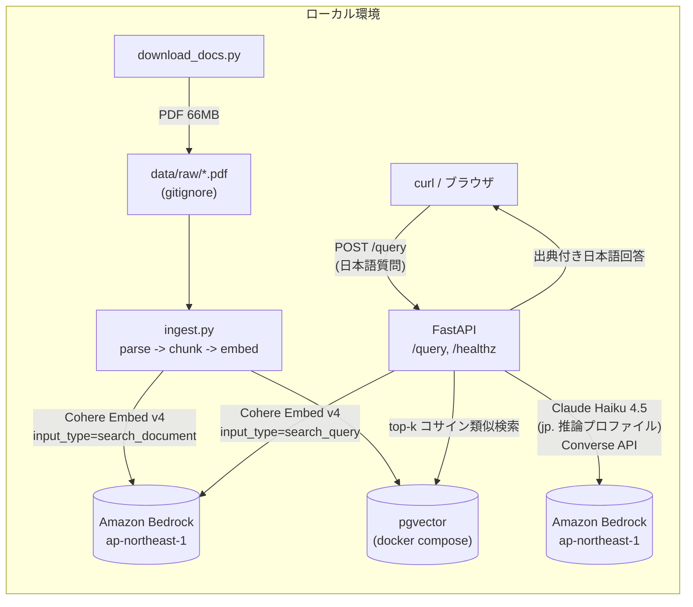
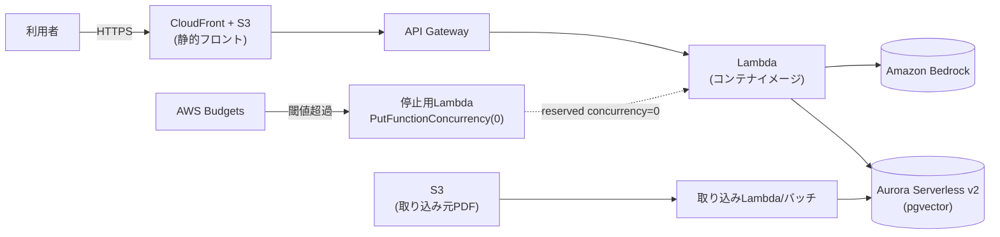

# アーキテクチャ

## Phase 1: ローカル構成

- **取り込み**: `download_docs.py` → `ingest.py` (parse → chunk → embed → upsert)
- **推論**: FastAPI `/query` が検索 (Retrieve) と生成 (Generate) を実行
- ベクトルストアは pgvector (docker compose)。Bedrock 呼び出しは `app/bedrock.py` に集約

## Phase 2 以降 (想定)

- Lambda (コンテナイメージ) + API Gateway でサーバーレス化 (アイドル時ゼロ円)
- Aurora Serverless v2 は未使用時に停止する運用
- AWS Budgets → 停止用 Lambda によるコスト暴走対策 (計画書 §7.5)
- Terraform でモジュール分割 (`network` / `api` / `vector-store` / `ingestion` / `observability`)

## モデル選定の要約

| 用途 | モデル | 詳細 |
| --- | --- | --- |
| 埋め込み | `cohere.embed-v4:0` (1536次元) | [ADR 0002](adr/0002-embedding-model-selection.md) |
| 生成 | `jp.anthropic.claude-haiku-4-5-20251001-v1:0` | [ADR 0004](adr/0004-bedrock-inference-profile.md) |
| ベクトルストア | pgvector → Aurora Serverless v2 | [ADR 0001](adr/0001-vector-store-selection.md) |
| チャンク分割 | 見出し認識 + スライディングウィンドウ | [ADR 0003](adr/0003-chunking-strategy.md) |
