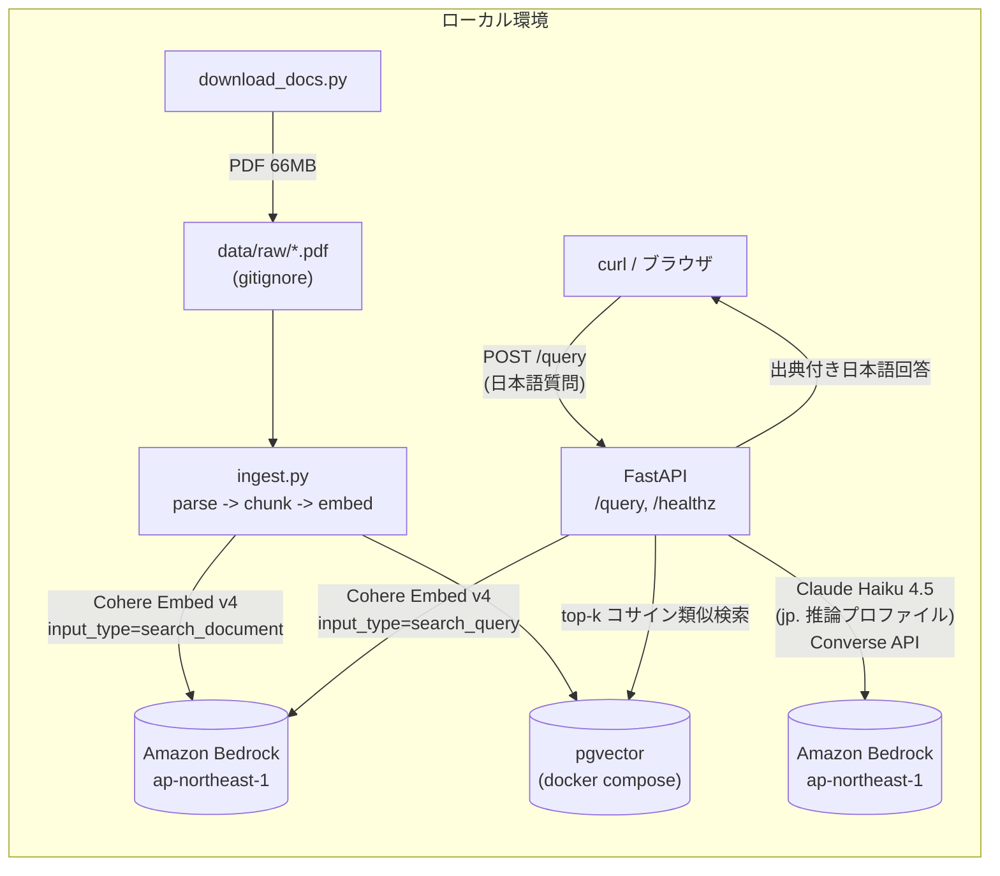
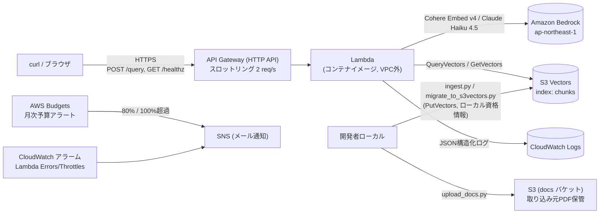

# アーキテクチャ

## Phase 1: ローカル構成

- **取り込み**: `download_docs.py` → `ingest.py` (parse → chunk → embed → upsert)
- **推論**: FastAPI `/query` が検索 (Retrieve) と生成 (Generate) を実行
- ベクトルストアは pgvector (docker compose)。Bedrock 呼び出しは `app/bedrock.py` に集約

## Phase 2: AWS 最小構成 (Terraform, デプロイ済み)

- Lambda (コンテナイメージ, x86_64) + API Gateway HTTP API でサーバーレス化 (アイドル時ゼロ円)
- **ベクトルストアは S3 Vectors** (Aurora Serverless v2 からの変更。[ADR 0005](adr/0005-s3-vectors-for-phase2.md))。
  VPC 不要のため NAT/VPC エンドポイントの常時課金が発生しない
- 取り込み (embed + PutVectors) はローカル/バッチから実行し、Lambda の実行時パスは
  検索専用 (最小権限の IAM)。[ADR 0006](adr/0006-lambda-container-http-api.md)
- AWS Budgets (月次) + CloudWatch アラーム (Errors/Throttles) → SNS メール通知。
  Budgets 超過時の自動停止 (計画書 §7.5) は Phase 4
- Terraform 構成: `infra/bootstrap` (tfstate用S3 + ECR, 一度きり) /
  `infra/modules/{vector-store,ingestion,api,observability}` / `infra/envs/dev`

## モデル選定の要約

| 用途 | モデル | 詳細 |
| --- | --- | --- |
| 埋め込み | `cohere.embed-v4:0` (1536次元) | [ADR 0002](adr/0002-embedding-model-selection.md) |
| 生成 | `jp.anthropic.claude-haiku-4-5-20251001-v1:0` | [ADR 0004](adr/0004-bedrock-inference-profile.md) |
| ベクトルストア | pgvector (Phase 1) → S3 Vectors (Phase 2) | [ADR 0001](adr/0001-vector-store-selection.md) / [ADR 0005](adr/0005-s3-vectors-for-phase2.md) |
| チャンク分割 | 見出し認識 + スライディングウィンドウ | [ADR 0003](adr/0003-chunking-strategy.md) |
| 実行基盤 | Lambda (コンテナイメージ) + API Gateway HTTP API | [ADR 0006](adr/0006-lambda-container-http-api.md) |
