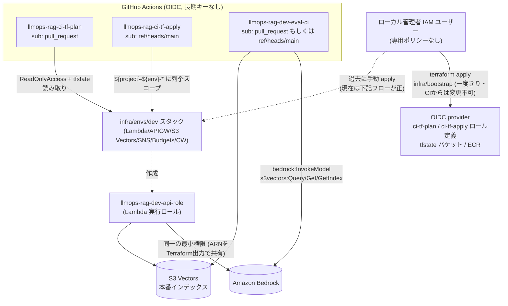

# IAM 権限まとめ

このリポジトリで AWS を操作する「誰が・どの経路で・何をできるか」を一箇所に整理したもの。
各設計判断の背景・検討経緯は [ADR 0006](adr/0006-lambda-container-http-api.md) /
[ADR 0008](adr/0008-github-oidc-iam-roles.md) を参照。本ドキュメントは決定記録ではなく、
**現在の設定を俯瞰するためのリファレンス**であり、Terraform コードの方が正 (差分が
出たらコード側を信じること)。

## 全体像

## ロール一覧

| ロール / ユーザー | 定義場所 | assume 元 (信頼ポリシー) | 用途 |
| --- | --- | --- | --- |
| ローカル管理者 IAM ユーザー | (AWS コンソールで手動作成、Terraform管理外) | ローカルの `aws configure` 資格情報 | `infra/bootstrap` の apply、`ingest.py`/`migrate_to_s3vectors.py` の実行。専用ポリシーなし (広い権限を前提とした個人開発用) |
| `llmops-rag-ci-tf-plan` | `infra/bootstrap/github_oidc.tf` | GitHub OIDC、`sub` が `...:pull_request` (PR イベント限定) | `terraform-plan.yml` — PR ごとに infra/envs/dev の plan を実行し PR にコメント (情報提供のみ、変更権限なし) |
| `llmops-rag-ci-tf-apply` | `infra/bootstrap/github_oidc.tf` | GitHub OIDC、`sub` が `...:ref:refs/heads/main` (main への push 限定) | `terraform-apply.yml` — main マージ時に ECR push → `terraform apply` → `/healthz` スモークテスト |
| `llmops-rag-dev-eval-ci` | `infra/modules/ci-eval/main.tf` | GitHub OIDC、`sub` が `pull_request` または `ref:refs/heads/main` | `eval.yml` — PR ごとに本番 S3 Vectors に対して読み取り専用で RAG 品質評価を実行 |
| `llmops-rag-dev-api-role` | `infra/modules/api/main.tf` | `lambda.amazonaws.com` (サービスロール) | Lambda 実行時 (検索専用。取り込みは含まない) |

`lint-and-test` ジョブ (`ci.yml`) は AWS を一切呼ばないため OIDC ロールを持たない。

## 各ロールの権限詳細

### `llmops-rag-ci-tf-plan`

- AWS 管理ポリシー `ReadOnlyAccess`
- `llmops-rag-ci-tf-plan-state`: tfstate オブジェクトの `GetObject` / ロックオブジェクト
  (`*.tflock`) への `GetObject`/`PutObject`/`DeleteObject` (S3 native locking 用) /
  `s3vectors:Get*`・`List*` (新しいサービスのため `ReadOnlyAccess` の追随漏れ保険)
- guardrail ポリシー (後述) をアタッチ

書き込み系アクションを一切持たないため、**plan が通ることは apply が通ることを保証しない**
(後述の「既知の落とし穴」参照)。

### `llmops-rag-ci-tf-apply`

3 本のカスタムポリシーに分割してアタッチ。1 本に統合しない理由は customer-managed policy
の 6,144 文字上限に余裕を持たせるためで機能的な意味はない
(現在のサイズ: `-compute` 約2,080文字 / `-data` 約1,390文字 / `-state` 数百文字、いずれも余裕あり)。

| ポリシー | 対象 | 主な許可 |
| --- | --- | --- |
| `llmops-rag-ci-tf-apply-state` | tfstate | オブジェクトの `GetObject`/`PutObject` + ロックオブジェクトの読み書き |
| `llmops-rag-ci-tf-apply-compute` | Lambda / CloudWatch Logs / API Gateway / ECR / IAM ロール・ポリシー | `lambda:*` (`function:${dev_prefix}-*`)、`logs:*` (ロググループ prefix スコープ) + `logs:DescribeLogGroups` (`Resource="*"` 必須、下記参照)、`apigateway:*` (`/apis*`、リソースレベル権限が実用的でないため広め)、`ecr:*` (該当リポジトリのみ)、IAM ロール管理 (`role/${dev_prefix}-*`) と IAM ポリシー管理 (`policy/${dev_prefix}-*`)、OIDC provider の読み取り (`iam:Get/ListOpenIDConnectProviders`) |
| `llmops-rag-ci-tf-apply-data` | S3 Vectors / S3 docs バケット / SNS / CloudWatch アラーム・ダッシュボード / Budgets / Bedrock (読み取りのみ) | `s3vectors:*` (`bucket/${dev_prefix}-*` 系)、`s3:*` (`${dev_prefix}-docs-*`)、`sns:*`、CloudWatch アラーム管理系アクション、CloudWatch ダッシュボード管理 (`Put`/`Get`/`DeleteDashboards` は `dashboard/${dev_prefix}*`、`ListDashboards` のみ `Resource="*"`。Phase 4)、`budgets:*`、`bedrock:Get/ListInferenceProfile`・`GetFoundationModel` (plan/apply 時の推論プロファイル ID 妥当性確認用、Bedrock リソース自体は作らない) |

いずれも `${project}-${env}-*` = `llmops-rag-dev-*` の命名規約でリソースレベルにスコープ
(API Gateway・EcrAuth・S3VectorsAccountLevel 等、リソースレベル権限が存在しないアクションのみ
アカウント全体 `*`)。

### `llmops-rag-dev-eval-ci` (module `ci-eval`)

- `bedrock:InvokeModel` — Lambda 実行ロールと**完全に同じ ARN** (embed FM + chat 推論プロファイル
  + そのルーティング先 FM) を `infra/envs/dev/main.tf` が `module.api` の出力からそのまま渡す
- `s3vectors:QueryVectors` / `GetVectors` / `GetIndex` のみ (`PutVectors` は含めない —
  取り込みは常にローカル/バッチから行う方針のため)

「eval CI は本番 Lambda が持たない権限では絶対に通らない」ことが ARN 共有によって構造的に
保証されている。

### `llmops-rag-dev-api-role` (Lambda 実行ロール)

- `logs:CreateLogStream`/`PutLogEvents` (自身のロググループのみ)
- `bedrock:InvokeModel` (embed FM + chat 推論プロファイル + ルーティング先 FM)
- `s3vectors:QueryVectors`/`GetVectors`/`GetIndex` (`PutVectors` は含まない。検索専用)

### guardrail ポリシー (`llmops-rag-ci-guardrail`, plan/apply 両方にアタッチ)

「CI が自分自身に権限を昇格させる」経路を構造的に塞ぐための Deny 専用ポリシー:

- `DenySelfPrivilegeEscalation`: `llmops-rag-ci-*` ロール自体・`policy/llmops-rag-ci-*` への
  `iam:*` を Deny
- `DenyOidcProviderTampering`: OIDC provider への変更系 7 アクション (`Create`/`Delete`/
  `UpdateThumbprint`/`AddClientID`/`RemoveClientID`/`Tag`/`Untag`) を Deny。**読み取り系は
  含めない** (下記の落とし穴参照)
- `DenyAccountAndUserEscalation`: `iam:CreateUser`/`CreateAccessKey`/`AttachUserPolicy`/
  `PutUserPolicy`、`organizations:*`、`account:*` を Deny
- `DenyTfstateBucketDeletion`: tfstate バケットの `s3:DeleteBucket` を Deny

apply ロールの IAM 権限はもともと `role|policy/llmops-rag-dev-*` にしかスコープしていない
ため、guardrail がなくても `llmops-rag-ci-*` 自体は触れない。「意図を明示するコード」として
二重に残している。

## 既知の落とし穴

これらは実際に本番 CI で踏んだ、または踏みかけた問題。同種の変更をするときは必ず確認する。

1. **immutable subject claim**: GitHub は `sub` にアカウント ID / リポジトリ ID を
   埋め込む形式 (`repo:owner@ownerID/repo@repoID:...`) を既定にしている。従来形式
   (`repo:owner/repo:...`) だけを `StringEquals` にすると 3 ロールすべてが
   `AssumeRoleWithWebIdentity` で `Not authorized` になる。`var.github_repo` (従来形式) と
   `var.github_repo_immutable` (immutable 形式) の**両方**を列挙する。現在値は
   `gh api repos/<owner>/<repo>/actions/oidc/customization/sub` で確認
2. **OIDC provider Deny のワイルドカード禁止**: guardrail の `DenyOidcProviderTampering` を
   `iam:*OpenIDConnectProvider*` の 1 行にすると `Get`/`List` にもマッチし、
   `data "aws_iam_openid_connect_provider" "github"` が読めず plan/apply が explicit deny で
   落ちる。変更系アクションのみ列挙し、読み取りは別途 Allow する
3. **trust policy が壊れると CI からは直せない (鶏卵)**: apply ロール自体が assume できなく
   なると `terraform-apply.yml` が動かない。ローカルの管理者資格情報から
   `infra/bootstrap` と `infra/envs/dev` の両方を手動 apply して復旧する
4. **plan が通っても apply の権限は検証されない**: plan ロールは `ReadOnlyAccess` を持つため
   大半の読み取りエラーを隠してしまう。apply ロールは列挙式スコープのみなので非対称。
   2026-08 の PR #2 マージ (初めて apply ロールが実行された回) で以下 2 件が発覚した
   ([PR #8](https://github.com/yasaims/LLMOps-RAG/pull/8) で修正):
   - `logs:DescribeLogGroups` は AWS の
     [サービス認可リファレンス](https://docs.aws.amazon.com/service-authorization/latest/reference/list_logs.html)
     上「Resource types」欄が空 = リソースタイプが定義されていないアクション。
     `log-group:*` のような ARN パターンを与えても `simulate-principal-policy` は
     `--resource-arns` の有無を問わず implicitDeny のまま。**`Resource` は文字どおり `"*"`
     でなければ機能しない**。`cloudwatch:DescribeAlarms` は composite alarm を返す場合のみ
     `*` が必要 (通常の metric alarm はリソースレベルスコープで足りる) など、アクションごとに
     挙動が異なるため、都度リファレンス表の「Resource types」欄を確認すること
   - `iam:GetPolicy` 等: IAM ロール管理 (`role/${dev_prefix}-*`) はあっても IAM **ポリシー**
     管理 (`policy/${dev_prefix}-*`) が抜けていた。`module.ci_eval` が作る
     customer-managed policy の read/update が全滅していた
5. **`simulate-principal-policy` の `--resource-arns` の罠**: リソースレベル権限を持たない
   アカウント全体アクション (`iam:ListOpenIDConnectProviders` など) に `--resource-arns` を
   付けると、実際には許可されていても `implicitDeny` と表示される。この種のアクションは
   `--resource-arns` を付けずに確認する
6. **`yasaims` は個人アカウント**: 「fork PR ワークフローに承認を必須にする」設定自体が
   Organization 限定機能で存在しないため無効化できない (常に承認必須)
7. **CloudWatch dashboard の ARN には region セグメントが無い** (Phase 4):
   `arn:aws:cloudwatch::${Account}:dashboard/${Name}` であり、他の CloudWatch リソース
   (alarm 等、`arn:aws:cloudwatch:${Region}:${Account}:...`) と違って region を含めると
   一致しない。`cloudwatch:ListDashboards` は他の List 系アクション同様リソースタイプが
   定義されていないため `Resource="*"` が必須 (落とし穴 4 と同種)

## 権限を変更するときの手順

1. `infra/bootstrap/github_oidc.tf` の変更は **CI からは apply できない**
   (guardrail が `policy/llmops-rag-ci-*` への `iam:*` を明示 Deny)。ローカルの管理者
   資格情報で `terraform -chdir=infra/bootstrap plan` → `apply`
2. 変更後は `aws iam simulate-principal-policy --policy-source-arn <role-arn> --action-names <action> [--resource-arns <arn>]`
   で確認。ただし上記の落とし穴 5 に注意 (account-level アクションは `--resource-arns` なしで)
3. 本命の検証は実際のワークフロー実行。plan ロールの `ReadOnlyAccess` に隠れて apply 側だけ
   足りない権限がある可能性を常に疑うこと (落とし穴 4)
4. `infra/envs/dev` 側 (`module.ci-eval` や `module.api` の IAM) は通常の CI フロー
   (`terraform-apply.yml`) で apply されるので、通常の PR プロセスで変更してよい

## 関連ドキュメント

- [ADR 0006](adr/0006-lambda-container-http-api.md): Lambda 実行ロールの設計
- [ADR 0008](adr/0008-github-oidc-iam-roles.md): OIDC ロール分割・guardrail の設計判断
- [ADR 0009](adr/0009-cicd-quality-gate.md): CI/CD ワークフロー全体の設計
- [docs/architecture.md](architecture.md): システム全体構成図
